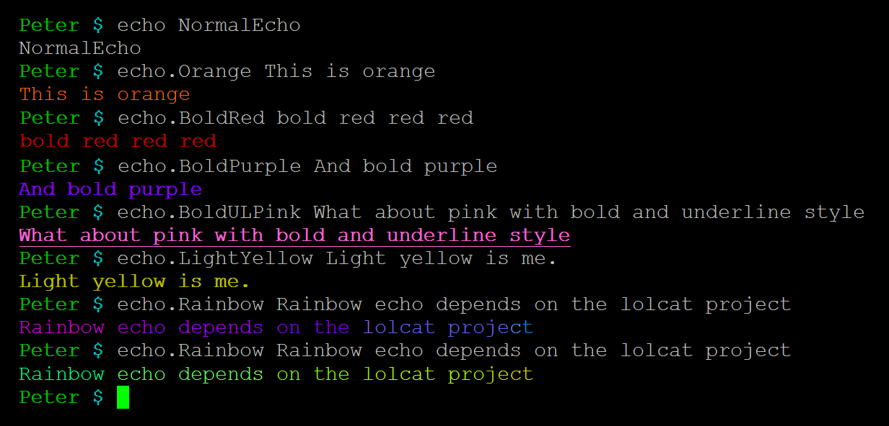
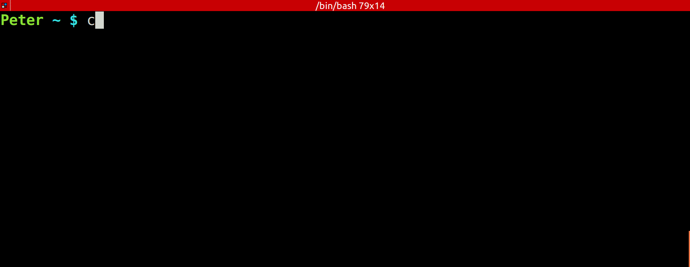

# ColorEchoForShell
Make echo colorful with easier method. In [bash](https://www.gnu.org/software/bash/), [sh](https://en.wikipedia.org/wiki/Bourne_shell), [fish](http://fishshell.com/), [ksh](http://www.kornshell.com/) and [zsh](http://www.zsh.org/).

## Installation

* Download the script, choice the once for your shell by its extension in the filename.
- For example [dist/ColorEcho.bash](https://cdn.rawgit.com/PeterDaveHello/ColorEchoForShell/master/dist/ColorEcho.bash) for bash.
* Add a line to include the script in your shell rc or run it directly:
`. ./ColorEcho.bash`

## Usage

* echo.`StyleColor` (if you are using `ksh`/`sh`, there is no `.` dot symbol)

### Examples

* echo.Cyan
* echo.ULCyan
* echo.LightCyan
* echo.BoldCyan
* echo.BoldULCyan

## Supported styles

* Bold as `Bold`
* Light as `Light`
* Underline as `UL`

## Supported colors

* See [color table](https://cdn.rawgit.com/PeterDaveHello/ColorEchoForShell/master/table.txt)

## Notes

* If you have [lolcat](https://github.com/busyloop/lolcat), you can also try `echo.Rainbow`.
* If you are using Mac OS, please upgrade your bash first, you can use [Homebrew](http://brew.sh/) or [MacPorts](https://www.macports.org/), the origin bash is too old.
* `sh` shell's color echo relys on external `/bin/echo`, it may not work properly with color under BSD and Mac OS.

## Screenshot

## Demo

## Author

[Peter Dave Hello](https://www.peterdavehello.org/), [@Twitter](https://twitter.com/PeterDaveHello), [@GitHub](https://github.com/PeterDaveHello)
